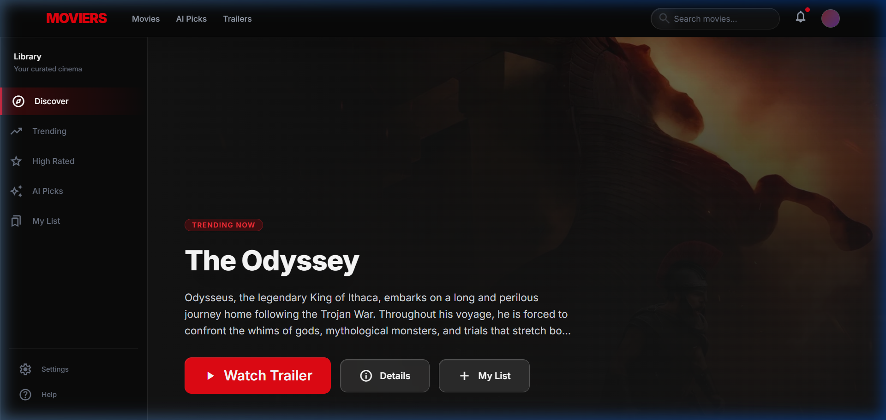
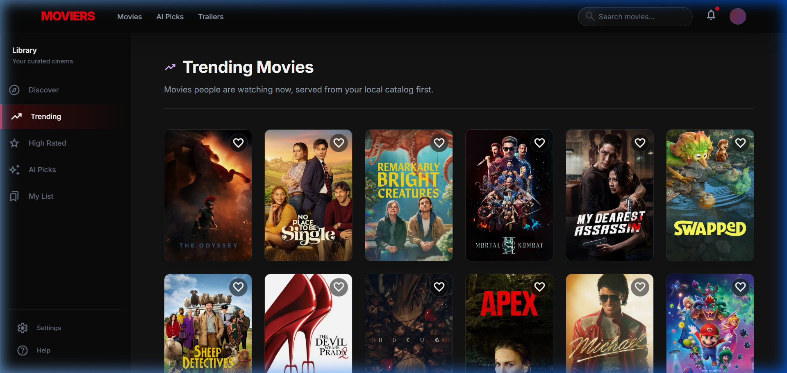
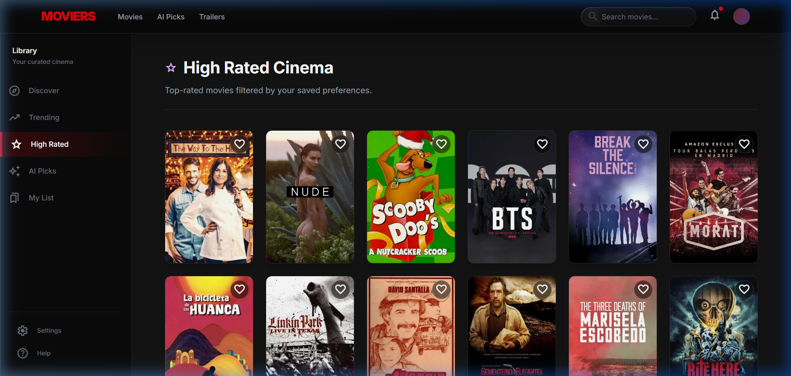
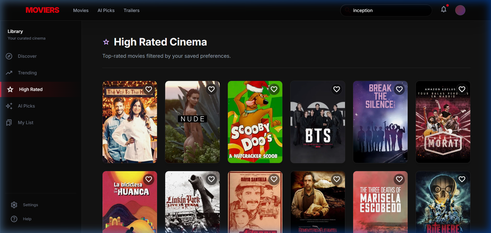

# MovieRS — AI-Powered Movie Recommendation System

> **Live Demo:** [http://3.111.150.141](http://3.111.150.141)

A production-grade, scalable movie recommendation web application using **TMDB API**, **TF-IDF + Cosine Similarity** for content-based filtering, **SQLite + FTS5** for persistent storage, and a modern **React** frontend — deployed on **AWS EC2** with Docker.

---

## Screenshots

### Homepage — Hero Section


### Trending Movies


### High Rated Cinema


### Search Results


---

## Architecture

```
User → React (Vite + Tailwind) → Nginx Reverse Proxy
                                      ↓
                              Flask API (Gunicorn)
                                      ↓
                ┌─────────────────────────────────────┐
                │         Cache-Aside Pattern          │
                │                                      │
                │   Redis (Hot Cache, TTL-based)       │
                │         ↓ miss                       │
                │   SQLite (Persistent Store, FTS5)    │
                │         ↓ stale                      │
                │   TMDB API (External Source)          │
                │         ↓ save                       │
                │   → SQLite + Redis (dual write)      │
                └─────────────────────────────────────┘
                                      ↓
                         ML Engine (TF-IDF + Cosine)
                                      ↓
                         APScheduler (Background Jobs)
                         - Pre-warms trending (6h)
                         - Pre-warms popular (6h)
                         - Refreshes genres (24h)
```

### Data Flow (Per Request)

```
Request → Check Redis → hit? Return (source: "redis")
                      → miss → Check SQLite → fresh? Return (source: "database")
                                            → stale → Fetch TMDB API
                                                    → Save to SQLite + Redis
                                                    → Return (source: "tmdb_api")
                                                    → API down? Return stale DB data
                                                              (source: "database_stale")
                                                    → Everything down? Return fallback
                                                              (source: "fallback")
```

Every API response includes a `source` field for transparency and debugging.

---

## Tech Stack

| Layer | Technology | Purpose |
|-------|-----------|---------|
| **Frontend** | React 18, Tailwind CSS v4, React Router v6, Axios | Modern SPA with dark glassmorphic UI |
| **Backend** | Python 3.11, Flask 3.1, Gunicorn | REST API with structured logging |
| **ML Engine** | Scikit-learn (TF-IDF), Cosine Similarity, Joblib | Content-based movie recommendations |
| **Database** | SQLite 3 (WAL mode, FTS5 full-text search) | Persistent movie store with ranked search |
| **Hot Cache** | Redis 7 (Alpine) | TTL-based in-memory caching |
| **Background Jobs** | APScheduler | Pre-warming trending/popular/genres |
| **Containerization** | Docker, Docker Compose | Multi-container orchestration |
| **Cloud** | AWS EC2 (t3.micro, free tier) | Production hosting |
| **Reverse Proxy** | Nginx | Serves React build + proxies API |
| **Data Source** | TMDB API v3 | Real-time movie metadata |

### Per-Category Staleness Configuration

| Category | Stale After | Reason |
|----------|-------------|--------|
| Trending | 6 hours | Changes frequently |
| Popular | 12 hours | Shifts slowly |
| High Rated | 7 days | Very stable |
| Movie Details | 7 days | Metadata rarely changes |
| Genres | 30 days | Almost never changes |
| Search Results | 12 hours | New movies added |

---

## API Endpoints

| Method | Path | Description | Source Tags |
|--------|------|-------------|------------|
| `GET` | `/api/v1/search?q=X&page=N` | Full-text movie search (FTS5) | redis, database, tmdb_api |
| `GET` | `/api/v1/movie/{id}` | Movie details | redis, database, tmdb_api, database_stale |
| `GET` | `/api/v1/recommend?movie_id={id}` | ML-powered recommendations | — |
| `GET` | `/api/v1/trending` | Weekly trending movies | redis, database, tmdb_api, fallback |
| `GET` | `/api/v1/popular?page=N` | Popular movies (paginated) | redis, database, tmdb_api, fallback |
| `GET` | `/api/v1/high-rated?page=N` | Top-rated movies | redis, database, tmdb_api, fallback |
| `GET` | `/api/v1/genres` | Genre ID → name mapping | redis, database, tmdb_api |
| `GET` | `/api/v1/movie/{id}/videos` | Movie trailers | redis, tmdb_api |
| `GET` | `/api/v1/health` | Health + DB stats | — |

### Query Parameters (Filtering)

All list endpoints support optional preference filters:
- `industry` — hollywood, bollywood, korean, japanese
- `language` — ISO 639-1 code (en, hi, ko, ja)
- `genre` — genre name filter

---

## Quick Start

### 1. Clone and configure

```bash
git clone https://github.com/deepanshu-talan/scalable-movie-recommendation-system.git
cd scalable-movie-recommendation-system
cp .env.example .env
# Edit .env and add your TMDB_API_KEY
```

### 2. Backend setup

```bash
python -m venv venv
source venv/bin/activate  # or .\venv\Scripts\activate on Windows
pip install -r requirements.txt
```

### 3. Build ML model (first time)

```bash
python scripts/fetch_tmdb_data.py --count 500  # Start small
python scripts/train_model.py
```

### 4. Start backend

```bash
python -m app.main
# Server runs at http://localhost:5000
```

### 5. Frontend setup

```bash
cd frontend
npm install
npm run dev
# App runs at http://localhost:5173
```

### Docker (Production)

```bash
cd docker
docker-compose up --build -d
# App runs at http://localhost (port 80)
```

---

## Project Structure

```
├── app/                       # Flask backend
│   ├── api/routes/            # API endpoints (movie, search, trending, etc.)
│   ├── core/                  # Config, logging (structlog), security (CORS, rate limiting)
│   ├── db/                    # Database layer
│   │   ├── movie_db.py        # SQLite persistent store (FTS5, triggers, staleness)
│   │   └── redis_client.py    # Redis connection factory
│   ├── ml/                    # ML pipeline
│   │   ├── model_loader.py    # Loads pre-trained artifacts
│   │   ├── preprocessing.py   # Text cleaning + feature engineering
│   │   ├── similarity.py      # Cosine similarity computation
│   │   └── vectorizer.py      # TF-IDF vectorization
│   └── services/              # Business logic
│       ├── cache_service.py   # Redis cache-aside operations
│       ├── local_movie_service.py  # Local movie catalog (DB-backed)
│       ├── recommendation_service.py  # ML recommendation engine
│       ├── scheduler.py       # APScheduler background jobs
│       └── tmdb_service.py    # TMDB API client
├── frontend/                  # React (Vite) app
│   ├── Dockerfile             # Multi-stage build (Node → Nginx)
│   ├── nginx.conf             # Reverse proxy + SPA routing
│   └── src/
│       ├── components/        # Layout, MovieCard, HeroSection, Skeleton
│       ├── pages/             # Home, Browse, MovieDetail, Search, etc.
│       ├── services/api.js    # Axios API client
│       └── hooks/             # useDebounce
├── docker/                    # Docker configuration
│   ├── Dockerfile             # Backend (Python + Gunicorn)
│   ├── docker-compose.yml     # Full stack: backend + frontend + Redis
│   └── ec2-user-data.sh       # EC2 bootstrap script
├── scripts/                   # Data fetching + model training
├── data/                      # ML artifacts + SQLite DB (runtime)
└── docs/screenshots/          # App screenshots
```

---

## AWS Deployment

### Infrastructure

| Resource | Type | Details |
|----------|------|---------|
| EC2 Instance | t3.micro (free tier) | ap-south-1, Amazon Linux 2 |
| Security Group | movie-recommender-sg | Ports 80 (HTTP) + 22 (SSH) |
| Key Pair | movie-recommender-key | SSH access |

### Deployment Architecture

```
EC2 Instance (t3.micro, 1 vCPU, 1 GB RAM)
├── Docker Compose
│   ├── frontend  (Nginx + React build)      → :80
│   ├── backend   (Gunicorn + Flask + SQLite) → :5000 (internal)
│   └── redis     (Redis 7 Alpine)            → :6379 (internal)
└── Named Volumes
    ├── movie_data (SQLite persistence)
    └── redis_data (cache persistence)
```

### Monitoring (CloudWatch)

EC2 instances have **CloudWatch Basic Monitoring** enabled by default:
- **CPU Utilization** — tracked every 5 minutes
- **Network In/Out** — bytes transferred
- **Disk Read/Write** — I/O operations
- **Status Checks** — instance + system health

**View in AWS Console:** EC2 → Instances → Select instance → Monitoring tab

For application-level monitoring, check structured logs:
```bash
ssh -i ~/.ssh/movie-recommender-key.pem ec2-user@3.111.150.141
cd app/docker
docker-compose logs -f backend
```

---

## Scaling Roadmap

| Phase | Component | Upgrade |
|-------|-----------|---------|
| Phase 1 (Current) | Database | SQLite (single-instance) |
| Phase 2 | Database | PostgreSQL (multi-instance) |
| Phase 2 | Search | Elasticsearch (fuzzy + semantic) |
| Phase 3 | ML | Collaborative filtering + hybrid |
| Phase 3 | Cache | Redis Cluster |
| Phase 3 | Compute | ECS Fargate (auto-scaling) |

---

## License

MIT
